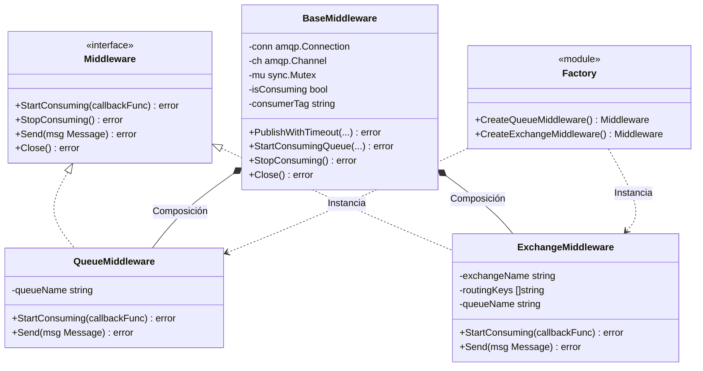
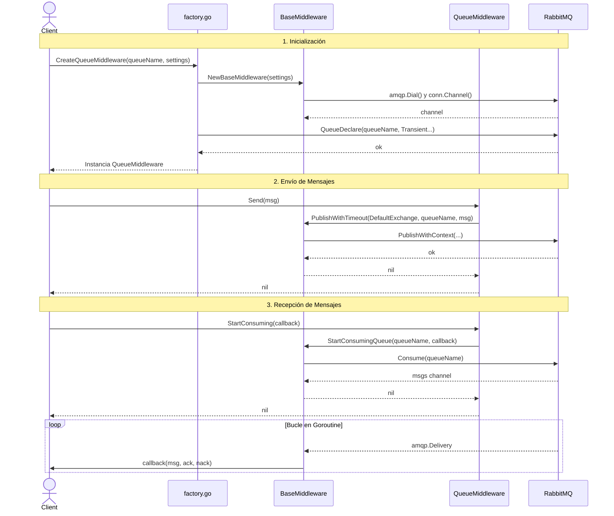
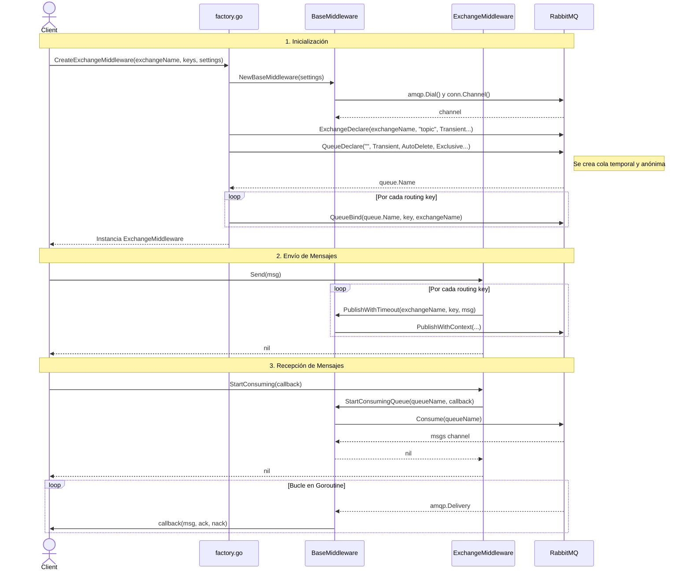

# Decisiones de Diseño

A continuación se detallan las principales decisiones arquitectónicas y de diseño adoptadas para implementar la interfaz definida en `middleware.go` utilizando la librería `amqp091-go`.

## 1. Composición y Reutilización de Código (DRY)
Se optó por utilizar composición embebiendo un struct padre llamado `BaseMiddleware` dentro de `QueueMiddleware` y `ExchangeMiddleware`. 
- **Conexión y Consumo:** `BaseMiddleware` centraliza la gestión de la conexión, el canal AMQP, y el bucle de consumo de la cola (`StartConsumingQueue`). Esto evita duplicar la lógica de consumo en las implementaciones específicas.
- **Manejo de Tiempos de Espera:** Se centralizó el envío de mensajes en `BaseMiddleware.PublishWithTimeout` implementando un contexto con timeout de 5 segundos. Esto protege al cliente de bloqueos indefinidos si la red se degrada.

## 2. Manejo Errores y Fugas de Recursos
Go no posee excepciones nativas, dentro de lo que pude investigar. Para garantizar la limpieza de recursos en caso de fallos de inicialización en la factory (`factory.go`), se utilizó el patrón idiomático de un `defer func()` junto con un flag booleano (`success`). Esto asegura que si cualquier operación AMQP (como `QueueDeclare` o `ExchangeDeclare`) falla en los pasos intermedios, la conexión subyacente se cierre correctamente, actuando de manera análoga a un bloque `finally`. 

A su vez, cualquier error de la librería subyacente AMQP se mapea de manera centralizada a los errores del dominio exigidos por la interfaz (ej. `ErrMessageMiddlewareDisconnected`, `ErrMessageMiddlewareMessage`).

## 3. Desacoplamiento mediante Constantes Expresivas
Se extrajeron todos los parámetros booleanos ("magic variables") utilizados por las configuraciones AMQP hacia constantes descriptivas compartidas (ej. `Transient`, `AutoDelete`, `Wait`, `Exclusive`). Esto con el fin de aportar más legibilidad a las definiciones de topologías.

## 4. Multicasting de Mensajes
Para el `ExchangeMiddleware`, si se instancian múltiples `routingKeys` (tópicos) en su creación, la operación de envío (`Send`) itera publicando el mensaje de manera independiente para cada tópico registrado. Esto abstrae la complejidad y garantiza que el productor envíe su mensaje a todos los destinos esperados.

---

# Arquitectura de Módulos

El siguiente diagrama ilustra cómo las estructuras concretas implementan la interfaz `Middleware` apoyándose de la composición con el struct `BaseMiddleware`.

---

# Diagramas de Secuencia

## Flujo de Trabajo en QueueMiddleware
El siguiente caso de uso muestra los pasos para crear el middleware apuntando a una cola, publicar un mensaje, e iniciar la escucha concurrente para recibirlos.

## Flujo de Trabajo en ExchangeMiddleware
Este caso es más complejo. Al instanciar como consumidor, es necesario configurar el exchange y crear una cola temporal y exclusiva, realizando posteriormente los *bindings* a los tópicos definidos.

